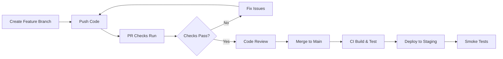
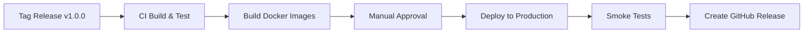

# CI/CD Pipeline Documentation

## Overview

Flash.SensitiveWords uses GitHub Actions for automated continuous integration and deployment. The pipeline ensures code quality, runs tests, and deploys to staging and production environments.

## Workflows

### 1. CI - Build and Test (`ci.yml`)

**Triggers:**
- Push to `main` or `develop` branches
- Pull requests to `main` or `develop`

**Jobs:**

#### Backend Build & Test
- Sets up .NET 8 SDK
- Restores dependencies and builds solution
- Spins up SQL Server for integration tests
- Runs unit tests (78 tests)
- Runs integration tests (55 tests)
- Generates code coverage reports
- Uploads coverage to Codecov

#### Frontend Build & Test
- Sets up Node.js 18
- Installs npm dependencies
- Runs ESLint
- Type checks with TypeScript
- Builds React app with Vite
- Uploads build artifacts

#### Quality Gate
- Enforces 85% code coverage threshold
- Fails build if coverage drops below threshold

**Coverage Reports:** Available at [codecov.io](https://codecov.io) (requires setup)

---

### 2. CD - Deploy (`cd.yml`)

**Triggers:**
- Push to `main` branch → Deploys to staging
- Git tags `v*.*.*` → Deploys to production
- Manual workflow dispatch

**Jobs:**

#### Build Docker Images
- Builds API Docker image
- Builds Frontend Docker image
- Pushes to GitHub Container Registry (ghcr.io)
- Uses build cache for faster builds

#### Deploy to Staging
- Deploys API to Azure Web App
- Deploys Frontend to Azure Static Web Apps
- Runs smoke tests (health check)
- Environment URL: `https://staging.flash-sensitivewords.com`

#### Deploy to Production
- Requires manual approval (GitHub environments)
- Deploys API to production Azure Web App
- Deploys Frontend to production Azure Static Web Apps
- Runs smoke tests
- Creates GitHub release for tagged versions
- Environment URL: `https://flash-sensitivewords.com`

---

### 3. PR Checks (`pr-checks.yml`)

**Triggers:**
- Pull request opened, updated, or reopened

**Jobs:**

#### Validate PR
- Checks commit message format (conventional commits)
- Scans for breaking changes

#### Lint Code
- Runs `dotnet format` on C# code
- Runs ESLint on React code
- Enforces code style consistency

#### Security Scan
- Trivy vulnerability scanner for dependencies
- TruffleHog for secret detection
- Uploads results to GitHub Security tab

#### Bundle Size Check
- Builds React app
- Verifies bundle size < 2MB
- Fails if bundle exceeds limit

---

## Setup Instructions

### 1. GitHub Secrets Configuration

Add these secrets in **Settings → Secrets and variables → Actions**:

#### Azure Deployment Secrets
```
AZURE_WEBAPP_PUBLISH_PROFILE_STAGING_API
AZURE_WEBAPP_PUBLISH_PROFILE_PROD_API
AZURE_STATIC_WEB_APPS_API_TOKEN_STAGING
AZURE_STATIC_WEB_APPS_API_TOKEN_PROD
```

#### Optional: Codecov Token
```
CODECOV_TOKEN
```

### 2. GitHub Environments Setup

Create two environments in **Settings → Environments**:

#### Staging Environment
- Name: `staging`
- URL: `https://staging.flash-sensitivewords.com`
- Protection rules: None (auto-deploy)

#### Production Environment
- Name: `production`
- URL: `https://flash-sensitivewords.com`
- Protection rules:
  - ✅ Required reviewers (at least 1)
  - ✅ Wait timer: 5 minutes
  - ✅ Deployment branches: `main` and tags only

### 3. Enable GitHub Packages

The pipeline pushes Docker images to GitHub Container Registry. To enable:

1. Go to **Settings → Actions → General**
2. Under **Workflow permissions**, select:
   - ✅ Read and write permissions
   - ✅ Allow GitHub Actions to create and approve pull requests

### 4. Database Migration Strategy

The pipeline assumes database schema is managed via:
- SQL scripts in `SensitiveWords.MicroService/Database/`
- Migrations run during deployment startup
- Connection strings stored in Azure App Settings

---

## Local Testing

### Test CI Pipeline Locally

Using [act](https://github.com/nektos/act):

```bash
# Install act
choco install act-cli

# Run CI workflow
act push --workflows .github/workflows/ci.yml

# Run PR checks
act pull_request --workflows .github/workflows/pr-checks.yml
```

### Manual Docker Build

```bash
# Build API
cd SensitiveWords.MicroService
docker build -t flash-sensitivewords-api:local .

# Build Frontend
cd ../SensitiveWords.React
docker build -t flash-sensitivewords-frontend:local .

# Test containers
docker run -p 8080:8080 flash-sensitivewords-api:local
docker run -p 3000:80 flash-sensitivewords-frontend:local
```

---

## Deployment Flow

### Feature Development Flow



### Production Release Flow



---

## Coverage Reports

### View Coverage Locally

```bash
# Run tests with coverage
.\SpecialScripts\run-tests.bat

# Open coverage report
start .\TestResults\Coverage\index.html
```

### View Coverage in CI

1. Go to GitHub Actions run
2. Download `coverage` artifact
3. Extract and open `index.html`

Or view on [Codecov.io](https://codecov.io) (after setup)

---

## Rollback Strategy

### Rollback Staging

```bash
# Re-deploy previous version
gh workflow run cd.yml -f environment=staging
```

### Rollback Production

```bash
# Find previous release tag
git tag -l "v*" --sort=-version:refname | head -2

# Re-deploy previous tag
git push origin <previous-tag>
```

Or manually re-deploy from Azure Portal:
1. Go to Azure Web App → Deployment Center
2. Select previous deployment slot
3. Click "Swap" to switch slots

---

## Monitoring & Alerts

### Build Status Badge

Add to README.md:

```markdown


```

### Notifications

Configure in **Settings → Webhooks** or use GitHub mobile app for deployment notifications.

---

## Troubleshooting

### SQL Server Connection Issues in CI

If integration tests fail with connection errors:

1. Check SQL Server is running in workflow
2. Verify connection string format
3. Ensure database schema is created before tests

**Fix:** Update connection string in `ci.yml`:
```yaml
ConnectionStrings__DefaultConnection: "Server=localhost;Database=SensitiveWordsDB;User Id=sa;Password=YourStrong@Passw0rd;TrustServerCertificate=True;"
```

### Docker Build Failures

If Docker builds fail:

1. Check Dockerfile paths are correct
2. Verify all project references exist
3. Test build locally first

**Debug:**
```bash
docker build --progress=plain -t test . 2>&1 | tee build.log
```

### Coverage Threshold Failures

If quality gate fails on coverage:

1. Check which files dropped coverage
2. Add missing tests
3. Or adjust threshold in `ci.yml`:

```yaml
/p:Threshold=85  # Lower if needed
```

### Deployment Failures

If Azure deployment fails:

1. Check publish profile secrets are current
2. Verify Azure resources exist
3. Check Azure service health status

**Get new publish profile:**
```bash
az webapp deployment list-publishing-profiles \
  --name flash-sensitivewords-api-prod \
  --resource-group flash-rg \
  --xml
```

---

## Performance Metrics

### Average Build Times

- Backend Build & Test: ~5 minutes
- Frontend Build & Test: ~2 minutes
- Docker Image Build: ~3 minutes
- Total CI Pipeline: ~10 minutes
- Deployment to Azure: ~5 minutes

### Optimization Tips

1. **Use caching:**
   - npm cache (already enabled)
   - NuGet cache (already enabled)
   - Docker layer cache (already enabled)

2. **Parallel jobs:**
   - Backend and frontend run in parallel
   - Independent test suites run concurrently

3. **Skip unnecessary steps:**
   - Only build Docker on `main` branch pushes

---

## Cost Considerations

### GitHub Actions Minutes

- Free tier: 2,000 minutes/month
- Estimated usage: ~500 minutes/month (50 builds × 10 min)

### GitHub Container Registry

- Free tier: 500 MB storage
- Estimated usage: ~200 MB (2 images × 100 MB)

### Azure Resources (Not Included)

- Azure Web App: ~$10-50/month per environment
- Azure Static Web Apps: Free tier available
- Azure SQL Database: ~$5-100/month depending on tier

---

## Next Steps

1. **Set up secrets** - Add Azure deployment credentials
2. **Create environments** - Configure staging and production
3. **Test pipeline** - Push a test commit to trigger CI
4. **Tag release** - Create `v1.0.0` tag for production deploy
5. **Monitor** - Watch first deployment and verify smoke tests pass

---

## References

- [GitHub Actions Documentation](https://docs.github.com/en/actions)
- [Azure Web Apps Deployment](https://docs.microsoft.com/en-us/azure/app-service/)
- [Docker Best Practices](https://docs.docker.com/develop/dev-best-practices/)
- [Codecov Documentation](https://docs.codecov.com/)
